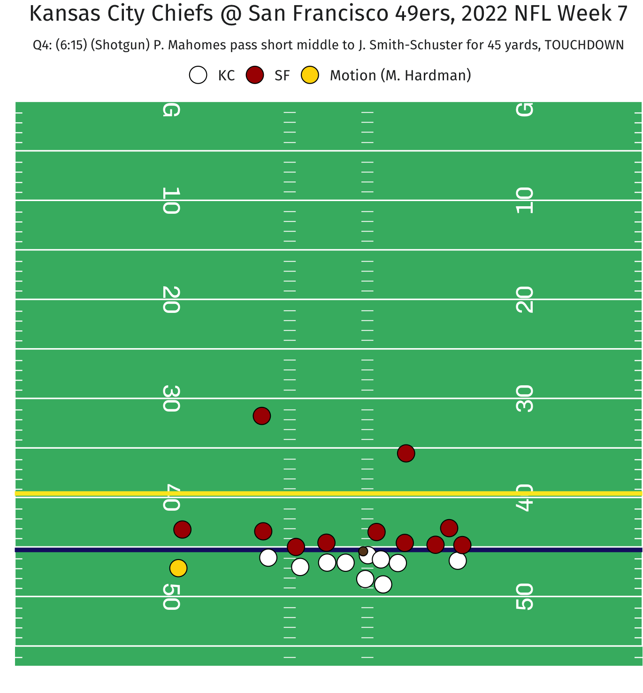

```{r}
#| include: false
knitr::opts_chunk$set(
  echo = FALSE,
  message = FALSE,
  warning = FALSE,
  fig.align = "center"
)
```

---

# Introduction

Consider the following two pass attempts by Kansas City Chiefs QB Patrick Mahomes in the 2022 NFL regular season.
The first play (left) is a 9-yard pass to WR Marquez Valdes-Scantling for a first down in the second quarter of Colts vs Chiefs in week 3.
The second play (right) is a 45-yard TD pass to WR JuJu Smith-Schuster in the fourth quarter against the 49ers in week 7.
In both plays, KC (in white) uses the same type of motion---glide, as the motion player (in gold) initially lines up in an outside wide alignment before moving laterally toward the inside.

:::: {style="display: flex;"}

::: {}

<center>

</center>

:::

::: {}

<center>

</center>


:::

::::

In both figures, the solid gold line along the motion player's movement path represents the path portion between the start of motion to the ball snap.
It is apparent that the plays differ in the duration of this highlighted trajectory portion.
In the first play, the snap happens 3.6 seconds after Travis Kelce begins his motion, whereas in the second, less than a second elapses since Mecole Hardman starts motioning.
As both plays result in significant gains (1 first down and 1 TD), this highlights Mahomes' ability to anticipate, react, and time the ball snaps in a variety of situations, elevating the effectiveness of his teammates.

Thus, in every play, it is important for the QB to synchronize the snap with the team's offensive execution, for the sake of keeping the defense off balance and offense in control.
In this work, we focus on evaluating a passer's ability to adapt and align the snap with their team's pre-snap motion.
Our proposed framework culminates in a metric called STRAVA...

[[TODO: talk more about the timing variability even more here?]]

<!-- dictate the tempo of a play and exploit defensive vulnerabilities. -->

<!-- Story:  -->

<!-- higher variability = good?, give defense different looks -->

<!-- vs always the same time / low var -> figure out when snaps are gonna be -> not good? (more "predictable") -->

<!-- don't want defense to know when you're snapping -->

<!-- wanna be deceptive? -->

<!-- varying the amount of time between motion and snap -->

<!-- correlate -->

<!-- low var -> higher sack/havoc rate -> more vulnerable -->

<!-- low var: easier to predict when the snap will be -->


# Defining snap timing

We define the snap timing $\delta$ for a play as the number of frames elapsed between the start of motion $(t_{\text{motion}})$ and the ball snap $(t_{\text{snap}})$.
That is,$$\delta = t_{\text{snap}} - t_{\text{motion}}\,.$$ 
Note that in our analysis, we only consider **plays with players in motion at snap and running a route**.

Here, it is straightforward to obtain $t_{\text{snap}}$ for each play using frame label in the tracking data.
Conversely, identifying $t_{\text{motion}}$ requires more efforts, due to [inconsistency between player-level motion indicators and annotated tracking events](https://www.kaggle.com/competitions/nfl-big-data-bowl-2025/discussion/543709).

We use the following procedure to determine $t_{\text{motion}}$ for each play. 

*   For plays where the player in motion at snap is also the only player in motion since line-set, we use the `man_in_motion` event frame in the tracking data as the start of motion.

*   For the remaining plays (specifically, plays where motion player at snap is not the sole player in motion since line-set, and plays with players charted as in motion at snap but without a `man_in_motion` tracking event):

    *   We first observe the distribution for ratio between the speed at the `man_in_motion` event and the maximum speed between line-set and snap (only using plays with $t_{\text{motion}}$ identified earlier). 

    *   We then choose the average ratio value of 0.45 as the threshold for determining the start of motion for the remaining plays. Specifically, we assign $t_{\text{motion}}$ as the first frame between line-set and snap where the player reaches at least 45% of their top speed.


# Multilevel model for snap timing

<!-- (based on EDA) -->

## Model specification

The observed timing between motion and snap on a single play is surely attributable to numerous variables---from contextual and tracking features, to the players and team involved.
To this end, we fit the following multilevel model:

\begin{align*}
  \delta_i  &\sim \textsf{Gamma}(\lambda_i, \phi_i) \\
  \log \lambda_i &=\alpha_{q[i],m[i],d[i]} + \boldsymbol{\beta X_i} \\
  \log \phi_i &=\alpha_{q[i]} \\
  \alpha_q  &\sim \textsf{Normal}(\mu_{\alpha_q}, \sigma^2_{\alpha_q}) && \small{\textrm{for quarterback}} &q &= 1, \dots, Q \\
  \alpha_m  &\sim \textsf{Normal}(\mu_{\alpha_m}, \sigma^2_{\alpha_m}) && \small{\textrm{for motion player}} &m &= 1, \dots, M \\
  \alpha_d  &\sim \textsf{Normal}(\mu_{\alpha_d}, \sigma^2_{\alpha_d}) && \small{\textrm{for defensive team}} &d &= 1, \dots, D \\
\end{align*}

In detail, we model the response $\delta_i > 0$ (snap timing for play $i$) with a Gamma distribution, which is well-suited for a positive, continuous variable like our case.

We model the $\phi$ parameter, which represents the shape/variance of the distribution, with QB random effects.
This allows us to examine the variability in timing among the quarterbacks.
We hypothesize that a higher variability in timing is beneficial because it prevents defenses from predicting when the ball will be snapped.
This can potentially help the offense control the game flow and exploit defensive vulnerabilities.

[[TODO: why is this interesting. Connect with the intro/motivation.]]

For the mean parameter $\lambda$, the model consists of random intercepts for the quarterback, motion player, and defensive team.
We also account for features about play $i$ through $\boldsymbol{X_i}$, and estimate the coefficients $\boldsymbol \beta$ as fixed effects.
Specifically, we control for contextual information such as the current down, number of timeouts remaining for the offense, and play clock at the start of motion, since they can impact the timing between motion and snap.
We also account for the motion player's position (WR, TE, RB/FB) and the number of players in motion since line-set, as these personnel information can relate to timing.
Another feature that should be crucially important for modeling timing is the type of motion.
[[TODO: why do we need motion type]]
This information, however, is not included in the original data, prompting us to consider a clustering algorithm to identify the motion types.

## Model-based clustering of motion types

We use a Gaussian mixture model to obtain unsupervised labels for the motion types.
Our clustering input contains tracking data features describing the motion player's location at different events relative to the ball-snapper's location before the snap.
In particular, we compute the absolute difference in both horizontal (endzone) and vertical (sideline) directions between the motion player at the moment of snap and the snapper.
We also include the vertical displacement between the snapper and the motion player at both the start of motion and when they cross the line of scrimmage (LOS).
If the motion player never crosses LOS on a play, we instead use the location at either the QB event (e.g., forward pass, sack, fumble) or 3 seconds after the snap, whichever occurs first.
This threshold is chosen using the observed distribution for time elapsed from snap to crossing LOS for plays where motion players do cross LOS, as it captures a sufficiently large fraction (~95%) of the values.

<!-- 
I prefer "snapper" to "center" here 
-->

We perform clustering via the `mclust` `R` package, and obtain an optimal number of clusters of 7 motion types (chosen using BIC).

[[TODO: flesh this out]]

This should provide a reasonable starting point for identifying the different types of motion.

The focus of our approach is not in designing the best clustering algorithm; something reasonable should be enough. (verified with visual inspection...)

[[TODO: mention limitations in discussion]]

<!-- 
a finite mixture of 7 ellipsoidal multivariate Gaussian distributions with varying volume, shape, and orientation (VVV model)
Once the clusters are identified, we can the label the motion types to add more context to our cluster assignments.
-->

# Analysis

Our model is fitted in a Bayesian framework via the `brms` `R` package using 4 parallel chains, each having 10,000 iterations and 5,000 burn-in draws.
We perform diagnostics by computing the $\widehat R$ and effective sample size statistics and find no issues regarding model convergence and efficiency, respectively.
Ultimately, we obtain the posterior distributions for our model parameters and perform the following analysis.

Of primary interest, we focus on the shape/variance parameter in our model.
The following figure displays the posterior distributions for the QB random intercept (ordered by posterior means) for those with at least 50 pass attempts across the considered plays.

Can we rename this? (like what ability is this?)

Spoiler alert: Patrick Mahomes is really good at football.

```{r}
#| fig-height: 8
#| fig-width: 6
readRDS("../figures/posteriors_slab.rds")
```


We further examine the relationship between the aforementioned QB posterior means and a measure of "havoc rate". 
Here, a havoc event is defined as whether any of the following outcomes are generated on a play: pass breakup, forced fumble, tackle for loss, interception, sack, and pressure.
The figure below is a scatterplot of the posterior mean and havoc rate for all passing plays (left) and only the considered motion plays (right) during the first nine weeks of the 2022 NFL regular season.

We observe a moderately strong, negative correlation between the quantities.
Thus, lower variability in snap timing corresponds to higher rate of facing disruptive events created by the opposing defense.


```{r}
#| fig-height: 4.5
#| fig-width: 10
readRDS("../figures/corr_havoc.rds")
```


<!-- passDefensed -->
<!-- forcedFumbleAsDefense -->
<!-- tackleForALoss -->
<!-- hadInterception -->
<!-- sackYardsAsDefense -->
<!-- causedPressure -->


# Discussion

We have introduced...


This work is not without limitations, leaving potential avenues for future work.
To identify the start of motion, we use a threshold-based criterion which relies only a fraction of a player's top speed prior to the snap.
This is certainly a simple viewpoint, as one could come up with a more rigid definition by building a model to predict the starting motion frame.
There may also be room for improvement in clustering the motion types by having more refined features (e.g., [[TODO: what are these?]]), or alternatively using a functional clustering approach.

# Appendix

All code is available at https://github.com/qntkhvn/timing.

<!-- STRAVA: <u>S</u>NAP <u>T</u>IMING <u>R</u>HYTHM, <u>A</u>DAPTIVITY & <u>VA</u>RIABILITY -->