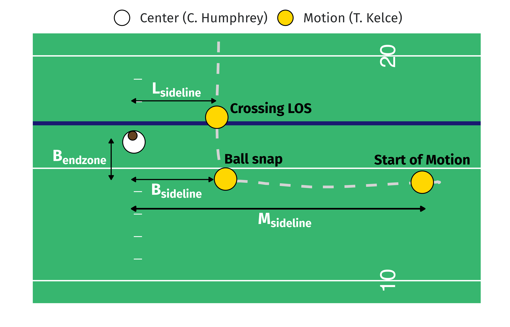

```{r}
#| include: false
knitr::opts_chunk$set(
  echo = FALSE,
  message = FALSE,
  warning = FALSE,
  fig.align = "center"
)
```

---

# Introduction

Consider the following two pass attempts by Kansas City Chiefs quarterback Patrick Mahomes in the 2022 NFL regular season.
The first play (left) is a 9-yard pass to WR Marquez Valdes-Scantling for a first down against the Colts in week 3.
The second play (right) is a 45-yard TD pass to WR JuJu Smith-Schuster against the 49ers in week 7.
In both plays, KC (in white) uses the same type of motion---glide, as the motion players (in gold) initially line up in an outside wide alignment before moving laterally toward the inside.

:::: {style="display: flex;"}
::: {}
<br>
<center>

</center>
:::
::: {}
<br>
<center>

</center>
:::
::::

In each animation, the solid gold line along the motion player's path (dashed gray line) represents the trajectory portion between the start of motion and the ball-snap.
It is apparent that the plays differ in the time duration of this color-coded portion of the path.
In the first play, the snap happens 3.6 seconds after Travis Kelce begins his motion, whereas in the second, less than a second elapses since Mecole Hardman starts motioning.
As both plays result in significant gains (a first down and touchdown), this highlights Mahomes' ability to react, anticipate, and time the snaps in various situations, elevating the effectiveness of the entire KC offensive unit.

Thus, in every play, it is important for the quarterback to synchronize the snap with the team's offensive execution, in order to keep the defense off balance and offense in control.
In this work, **we propose a multilevel modeling framework to assess a passer's ability to adapt and align the snap with their team's pre-snap motion, culminating in a novel approach for measuring variability in QB snap timing**.

# Defining snap timing

We define the snap timing $\delta$ for a play as the number of frames elapsed between the start of motion $(t_{\text{motion}})$ and the ball-snap $(t_{\text{snap}})$.
That is,$$\delta = t_{\text{snap}} - t_{\text{motion}}\,.$$ 
Note that in our analysis, we only consider **plays with receivers in motion at snap and also running a route**.

Here, it is straightforward to obtain $t_{\text{snap}}$ for each play using the frame label in the tracking data.
Conversely, identifying $t_{\text{motion}}$ requires more effort, due to [inconsistency between player-level motion indicators and annotated tracking events](https://www.kaggle.com/competitions/nfl-big-data-bowl-2025/discussion/543709).

We use the following procedure to determine $t_{\text{motion}}$ for each play. 

*   For plays where the player in motion at snap is also the only player in motion since line-set, we use the `man_in_motion` event frame in the tracking data as the start of motion.

*   For the remaining plays (specifically, plays where motion player at snap is not the sole player in motion since line-set, and plays with players charted as in motion at snap but without a `man_in_motion` tracking event):

    *   We first observe the distribution for ratio between the speed at the `man_in_motion` event and the maximum speed between line-set and snap (only using plays with $t_{\text{motion}}$ identified earlier). 

    *   We then choose the average ratio value of 0.45 as the threshold for determining the start of motion for the remaining plays. Specifically, we assign $t_{\text{motion}}$ as the first frame between line-set and snap where the player reaches at least 45% of their top speed.
    
<!-- limitation of this is discussed in Discussion section -->


# Multilevel model for snap timing

## Model specification

The observed timing between motion and snap on a single play is surely attributable to numerous variables---from contextual and spatiotemporal features, to the players and teams involved.
To this end, we fit the following multilevel model:
$$
\begin{aligned}
\delta_i  &\sim \textsf{Gamma}(\mu_i, \alpha_i) \\
\\
\log \mu_i &= \gamma_0 + \boldsymbol{\beta X_i} + b_{q[i]} + b_{m_[i]} + b_{d[i]} \\
b_q  &\sim \textsf{Normal}(0, \sigma^2_q)\\
b_m  &\sim \textsf{Normal}(0, \sigma^2_m)\\
b_d  &\sim \textsf{Normal}(0, \sigma^2_d)\\
\\
\log \alpha_i &= \psi_0 + u_{q[i]} \\
u_q  &\sim \textsf{Normal}(0, \tau^2_q)\\
\end{aligned}
$$
In detail, we model the response $\delta_i > 0$ (snap timing for play $i$) using a Gamma distribution (with log link function,
[parameterized by two parameters: mean $\mu$ and shape $\alpha$](https://paulbuerkner.com/brms/articles/brms_families.html#:~:text=The%20density%20of%20the%20Gamma,shape%20parameter)),
which is well-suited for a positive, continuous variable like our case.

Of primary interest, we model the shape/variance $\alpha$ of the distribution with QB random effects.
This allows us to examine the variability in timing between motion and snap among NFL quarterbacks.
From an offensive standpoint, we hypothesize that a higher timing variability is beneficial because it prevents defenses from predicting when the snap will occur.
This also allows the offense to control the game flow and exploit defensive vulnerabilities.

We also model the mean parameter $\mu$ by including random intercepts for three groups: quarterback $q$, motion player $m$, and defensive team $d$.
Moreover, we account for contextual and personnel information about play $i$ through $\boldsymbol{X_i}$, and estimate the coefficients $\boldsymbol\beta$ as fixed effects.
These include the current down, number of timeouts remaining for the offense, play clock at the start of motion, motion player's position (WR, TE, RB/FB), and number of players in motion since line-set, as they all can impact the timing between motion and snap.
Another vital feature for modeling snap timing is the type of motion, since it relates to play design.
For instance, in a play-action pass, a team can fake a jet sweep to set up the QB for a pass.
This information, however, is not provided in the data, prompting us to consider a clustering algorithm to identify the motion types.

## Motion type clustering

Our clustering input contains tracking data features describing the motion player's location at different events relative to where the ball-snapper lines up before the snap.
The following figure illustrates the derived features for the example play from earlier with Travis Kelce in motion.
We compute the displacement at ball-snap between the motion player and snapper in both sideline $(\textsf{S}_{\textsf{sideline}})$ and endzone $(\textsf{S}_{\textsf{endzone}})$ directions.
We also include the displacement with respect to the sideline between the snapper and motion player at the start of motion $(\textsf{M}_{\textsf{sideline}})$ as well as when they cross the line of scrimmage (LOS) $(\textsf{L}_{\textsf{sideline}})$.

<center>

</center>

Note that for plays where the motion player never crosses the LOS, we instead use their location at either the QB event (e.g., forward pass, sack, fumble) or 3 seconds after the snap (depending on which happens sooner) in place of $\textsf{L}_{\textsf{sideline}}$.
The aforementioned 3-second threshold is chosen using the observed distribution of the time elapsed from snap to crossing LOS for plays where motion players do cross the LOS, as it captures a sufficiently large fraction (~95%) of the values.

<!-- I prefer "snapper" to "center" here -->

We fit a Gaussian mixture model via the `mclust` `R` package to obtain unsupervised labels for the pre-snap motions.
We choose the optimal number of Gaussian clusters using BIC, and validate the cluster assignment results by visualizing the player motion trajectories in each cluster.

<!-- limitation of this is discussed in Discussion section -->

# Analysis

Our multilevel model is fitted in a Bayesian framework via the `brms` `R` package using 4 parallel chains of 10,000 iterations and 5,000 burn-in draws.
We perform diagnostics by inspecting trace plots as well as computing the $\widehat R$ and effective sample size statistics, and find no issues with model convergence and efficiency.
Ultimately, we obtain posterior distributions for our model parameters and perform the following analysis.

## Leaderboard

The following figure displays the posterior distributions for the shape/variance random effect (ordered by posterior mean) for QBs with at least 50 pass attempts across the considered motion plays.
For each player, the posterior mean of the aforementioned distribution provides an estimate for their ability to maintain variability in snap timing, **with higher posterior mean values corresponding to greater variability in timing between motion and snap**.

Patrick Mahomes stands out as the top QB according our measure, adding the ability to time snaps as another element to his success.
Other high-caliber QBs such as Tom Brady and Josh Allen are also among the top players in our rankings.
Note that there is considerable uncertainty in our estimates, as demonstrated by the rather wide credible intervals, which is unsurprising given our limited sample of motion plays.
Still, we observe substantial differences in the credible intervals across this subset of QBs.
For instance, despite his pay, Daniel Jones' 95% CI does not overlap at all with the 95% CIs of the top five QBs.

```{r}
#| fig-height: 8
#| fig-width: 6
readRDS("../figures/posteriors_slab.rds")
```

## Comparison to havoc rate

Next, we examine the relationship between the posterior mean for the QB shape/variance random effect and a measure of "havoc rate".
Here, a havoc event is defined as whether any of the following defensive outcomes are generated on a play: pass breakup, forced fumble, tackle for loss, interception, sack, and pressure.
The figure below is a scatterplot of the aforementioned posterior mean and havoc rate for all pass plays over the first nine weeks of the 2022 NFL season (left) and only the considered motion plays (right) for the same subset of QBs as before.

**We observe that lower snap timing variability corresponds to higher rate of facing havoc events created by the opposing defense.**
This makes intuitive sense, as when there is little variability in timing, the offense is likely to be predictable and experience unfavorable play outcomes.
In contrast, by varying the duration between motion and snap, offenses can create uncertainty, forcing defenders to play more cautiously which reduces their effectiveness in executing disruptive plays.

```{r}
#| fig-height: 4.1
#| fig-width: 10
readRDS("../figures/corr_havoc.rds")
```

# Discussion

Variability in snap timing is an essential aspect for an offense to dictate plays and make it difficult for defenses to anticipate and react.
Through multilevel modeling, we provide an assessment of a quarterback's ability to maintain variable snap timing with their teammates' motion.
We demonstrate that higher variability in snap timing is beneficial for the passing game, as it relates to experiencing less disruptions generated by the defense.

Our proposed framework is not without limitations.
First, to identify the start of motion, we use a threshold-based criterion which relies on the moment at which the motion player achieves a certain fraction of their top speed prior to the snap.
This is certainly a simple viewpoint, as one could come up with a more rigid definition by building a model to predict the starting motion frame.
Further, despite the reasonable set of inputs in our cluster analysis, there is possibly room for improvement in identifying the motion types by having more refined features, or alternatively using a functional clustering approach.
Since neither of these tasks is the main focus of our work, we leave these explorations for the future.

[[TODO: mention QB awareness/pocket presence. (should go in first paragraph?)]]

[[TODO: mention selections of QB---no Jalen Hurts/Joe Burrow]]

# Appendix {-}

All code is available at https://github.com/qntkhvn/timing.

RY thanks Sam Schwartzstein for a conversation which motivated the idea of measuring variability in QB snap timing.
QN thanks Nick Wan whose [Twitch stream](https://www.twitch.tv/nickwan_datasci) and [Kaggle notebook](https://www.kaggle.com/code/nickwan/fly-sweeps-are-the-best-rushing-play) inspired the definition and identification of motion in this work.

On a personal note, QN failed to convince RY to name the metric *STRAIN (Patrick's version)*, where STRAIN stands for Snap Timing Rhythm and Adaptability INdex.

---

[Quang Nguyen](https://github.com/qntkhvn) and [Ron Yurko](https://github.com/ryurko)

Department of Statistics & Data Science

Carnegie Mellon University
