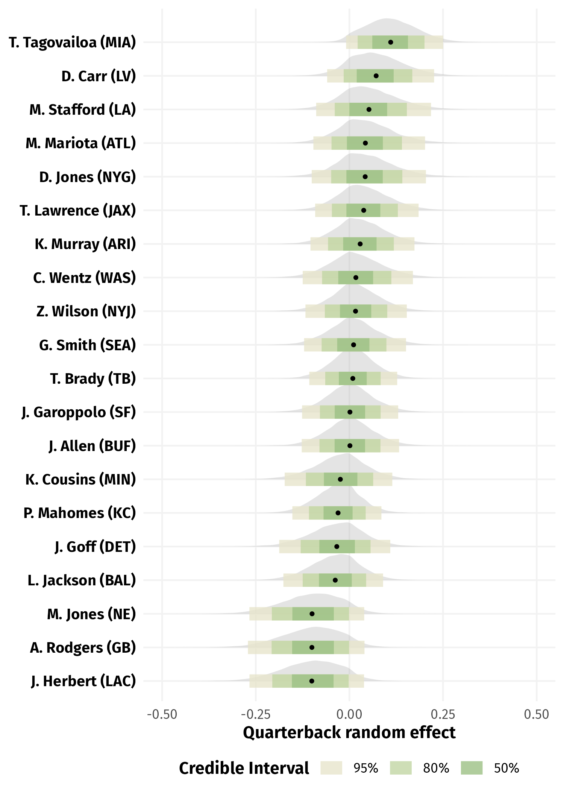

 
```{r}
#| label: setup
#| include: false
knitr::opts_chunk$set(
  echo = FALSE,
  message = FALSE,
  warning = FALSE,
  fig.align = "center",
  fig.pos = "ptb"
  # cache = TRUE
)
library(here)
library(tidyverse)
theme_set(theme_light())
```

<!-- \newpage -->

<!-- \captionsetup{font={stretch=1.25}} -->
<!-- \renewcommand{\arraystretch}{1.25} -->

\setlength{\parskip}{0.25\baselineskip}

# Introduction {#sec:introduction}

Recent developments in sports analytics have been largely sparked by player tracking data [@baumer2023big; @kovalchik2023player].
In American football, the National Football League (NFL) has been collecting tracking data since 2016 via the Next Gen Stats system, where RFID tags are placed in the shoulder pads of players and inside the football.
This records the location and trajectory of every player on the field within a play at a rate of 10 frames per second.
The richness and continuous nature of player tracking data provide substantial opportunities to gain deeper insight into various aspects of football that were not previously captured by discrete play-level data.

To make these fine-grained data accessible and promote public research, the NFL organizes the annual Big Data Bowl competition, beginning in 2018.
Each year, a sample of tracking data is publicly released to accompany a competition theme on a particular area of football (e.g., secondary, special teams, linemen, etc.).
Early peer-reviewed articles that leverage Big Data Bowl data mainly provide assessment of offensive production in American football.
@deshpande2020expected propose a framework for determining the hypothetical completion probability for a passing play.
@chu2020route detect the types of route ran by NFL receivers via a model-based clustering approach.
@yurko2020going introduce a continuous-time play valuation framework which features a model for the expected yards gained at every moment within a play.

Apart from offensive performance evaluation, tracking data have also driven considerable advancements in the assessment of NFL defenders.
This task was once very challenging, as position groups such as defensive linemen simply lacked reliable metrics to grade their performance prior to the availability of high-resolution data.
@dutta2020unsupervised use a mixture model to provide labels for the types of pass coverage by defensive backs.
@nguyen2024here present a novel metric for quantifying defensive pressure by pass rushers at every frame within a play.
@yurko2024nfl evaluate defensive pass coverage by comparing the defender positioning at the moment of catch to a baseline hypothetical player.
@nguyen2025fractional introduce a framework for within-play tackling evaluation, overcoming the limitations of traditional box-score tackles statistics.

Similar to defensive evaluation, it is possible to investigate other areas of football that were relatively understudied in the past with tracking data.
The 2025 edition of the NFL Big Data Bowl focuses on pre-snap motion, which has become an important strategic aspect in American football.
By employing actions such as motion, shifts, and alignment changes, a team's ultimate goal is to confuse its opponent and gain an advantage before the play even begins.
For the first time ever, we have access to on-field player locations for the full play---not just after the snap but also before the snap---via the Big Data Bowl 2025 tracking data sample.
This opens up an opportunity to leverage pre-snap information to better understand team and player behavior during a play post-snap.

<!-- 
**[[is this good enough for the motivation of snap timing?]]**
one way to validate that snap timing an actual thing: cite personal communication with the football coach
-->

Our analysis focuses on a specific aspect of pre-snap motion: the timing between the moment a receiver begins motioning and the ball snap event.
We are specifically interested in the variability in snap timing, which means across different plays, the offense does not snap the ball at the same time after a receiver goes in motion.
This can be considered a quarterback (QB) skill, since the QB is responsible for controlling the cadence and ensuring the offense operates smoothly in every play.
As such, it is important for the QB to synchronize the snap with motion from their teammates, in order to keep the defense off balance and offense in control.
We posit that if the snap timing is consistent or predictable, defenders can anticipate the snap count and time their actions to disrupt the play.
Thus, having variable snap timing may be valuable to the offense, as it makes it harder for the opposing defense to anticipate the snap and time their moves effectively.

In this work, we propose a multilevel modeling framework to assess a quarterback's ability to manage snap timing in the presence of pre-snap motion.
In doing so, we control for various personnel and contextual covariates at the play level, as well as random effects for the players and teams involved.
We implement our multilevel model in a Bayesian framework, which allows us to quantify uncertainty for the estimates of all model parameters.
Ultimately, our approach culminates in a measure of variability in QB snap timing, which is demonstrated to be predictive of the rate of havoc created by the opposing defense.
We believe our contribution provides a novel description of snap timing variability and reveals insights into an understudied area of American football.

The structure for the remainder of our paper is as follows.
In Section \ref{sec:data}, we offer an overview of the player tracking data in American football.
Next, we describe in detail our multilevel modeling methodology in Section \ref{sec:methods}.
We then discuss our modeling results and insights in Section \ref{sec:results}, before closing with our concluding remarks in Section \ref{sec:discussion}.

# Data {#sec:data}

In the analysis that follows, we leverage player tracking data from the NFL Big Data Bowl 2025 competition [@lopez2024nfl], which span the first nine week of the 2022 NFL regular season.
The data are collected at a rate of 10 Hz (i.e., 10 measurements per second) and provide two-dimensional location for every player on the field throughout a play, along with movement attributes such as speed, acceleration, orientation, and angle of motion.
It is worth noting that unlike previous editions of the Big Data Bowl where only a subset of frames are included for each play, we now have access to player tracking information for all frames within a play from pre-snap to post-snap.

The tracking data also record event tags for specific frames within each play.
Table \ref{tab:tracking} provides an example of the player tracking data for a play during the week 3 game of the 2022 NFL regular season between the Kansas City Chiefs and the Indianapolis Colts.
This play results in a 9-yard completed pass by Chiefs quarterback Patrick Mahomes to wide receiver Marquez Valdes-Scantling, with tight end Travis Kelce being the player going in motion before the snap.
In this example, the event annotations can be categorized into three different types: pre-snap (`huddle_break_offense`, `line_set`, `man_in_motion`), at the snap (`ball_snap`), and post-snap (`pass_forward`, `tackle`).

Besides the tracking data, we also have access to charting data from the NFL and Pro Football Focus.
This includes statistics at the player-play level, such as indicators about motion (e.g., whether the player goes in motion at ball snap, shifts since the lineset, etc.), as well as both the offense (e.g., whether the receiver is running a route, type of route ran, etc.) and defense (e.g., whether the defender records a quarterback hit, tackle, interception, fumble, etc.).
Later on, we use these player-play indicators to identify motion in Section \ref{sec:definition}, and compute a summary of defensive havoc rate in Section \ref{sec:havoc}.


\begin{table}[tbp]
\caption{Example of tracking data for a play during the Kansas City Chiefs versus Indianapolis Colts game on September 25, 2022. The data shown here are for Chiefs tight end Travis Kelce, who is the receiver in motion in this play. \label{tab:tracking}}
\centering
\begin{tabular}{ccccccccl}
\hline
frameId & x & y & s & a & dis & o & dir & event \\ 
\hline
1 & 20.78 & 21.18 & 2.81 & 1.46 & 0.27 & 149.05 & 161.56 & \texttt{huddle\_break\_offense} \\
\vdots & \vdots & \vdots & \vdots & \vdots & \vdots & \vdots & \vdots & \vdots \\
59 & 24.39 & 7.25 & 0.14 & 0.42 & 0.01 & 103.95 & 221.38 & \texttt{line\_set} \\
\vdots & \vdots & \vdots & \vdots & \vdots & \vdots & \vdots & \vdots & \vdots \\
81 & 24.38 & 8.13 & 1.58 & 7.33 & 0.13 & 110.90 & 358.39 & \texttt{man\_in\_motion} \\ 
\vdots & \vdots & \vdots & \vdots & \vdots & \vdots & \vdots & \vdots & \vdots \\
117 & 24.52 & 18.67 & 1.00 & 1.62 & 0.10 & 104.73 & 36.28 & \texttt{ball\_snap} \\ 
\vdots & \vdots & \vdots & \vdots & \vdots & \vdots & \vdots & \vdots & \vdots \\
138 & 34.05 & 19.18 & 6.22 & 2.34 & 0.63 & 92.17 & 83.35 & \texttt{pass\_forward} \\ 
\vdots & \vdots & \vdots & \vdots & \vdots & \vdots & \vdots & \vdots & \vdots \\
157 & 38.80 & 23.70 & 0.79 & 2.56 & 0.09 & 208.67 & 43.25 & \texttt{tackle} \\ 
\hline
\end{tabular}
\end{table}

# Methods {#sec:methods}

## Defining snap timing {#sec:definition}

In our analysis, we focus on passing plays with receivers in motion at snap and running a route, resulting in a total of 2,198 plays.
For play $i = 1, \dots, n$, let $t_i^{\text{motion}}$ denote the moment a receiver starts going in motion, and $t_i^{\text{snap}}$ denote the moment of ball snap.
We define the snap timing for play $i$ as the number of frames elapsed between the $t_i^{\text{motion}}$ and $t_i^{\text{snap}}$.
That is, $$\delta_i = t_i^{\text{snap}}-t_i^{\text{motion}}.$$
Here, it is straightforward to obtain $t_i^{\text{snap}}$ using the frame label in the tracking data.
Conversely, identifying $t_i^{\text{motion}}$ requires more effort, due to inconsistency between player-level motion indicators and annotated tracking events, as acknowledged by the competition organizers[^inconsistency].

We use the following procedure to determine $t_i^{\text{motion}}$ for each play.

* For plays where the player in motion at snap is also the only player in motion since line set, we identify  $t_i^{\text{motion}}$ as the frame of the `man_in_motion` event provided in the tracking data.

* For the remaining plays (specifically, plays where motion player at snap is not the only player in motion since line set, and plays with players charted as in motion at snap but without a `man_in_motion` event):

    * Using plays with $t_i^{\text{motion}}$ identified from earlier, we first observe the distribution for the ratio between the motion player's speed at `man_in_motion` and their maximum speed between line set and ball snap (see Figure \ref{fig:fig_ratio_distribution} in the Supplementary Materials).
    
    * We then choose the average ratio value of 0.45 as the threshold for determining the start of motion for the remaining plays. Specifically, we assign $t_i^{\text{motion}}$ as the first frame between line set and ball snap where the player reaches at least 45% of their top speed.
    
[^inconsistency]: See [`https://www.kaggle.com/competitions/nfl-big-data-bowl-2025/discussion/543709`](https://www.kaggle.com/competitions/nfl-big-data-bowl-2025/discussion/543709).

For context, Figure \ref{fig:fig_timing_distribution} displays the snap timing distribution for plays with receivers in motion at snap and running a route.
We observe a right skewed distribution, as about 95% of the snap timing values are within 50 frames (or 5 seconds), with a median of 17 frames (i.e., 1.7 seconds between the start of motion and ball snap).
It appears that the snap timing is relatively short across the considered motion plays.

```{r}
#| label: fig_timing_distribution
#| fig-cap: "Distribution of the snap timing across plays with receiver going in motion at the snap and running a route."
#| fig-height: 2.5
#| fig-width: 5
plays_snap_timing <- read_rds("../data/plays_snap_timing.rds")

# summary(plays_snap_timing$frame_between)
# quantile(plays_snap_timing$frame_between)

plays_snap_timing |> 
  ggplot(aes(frame_between)) +
  geom_histogram(bins = 40, fill = "gray90", color = "gray30") +
  theme_light() +
  labs(x = "Frames between motion and ball snap",
       y = "Frequency")
```


## Multilevel model for snap timing {#sec:model}

The observed timing between motion and snap on a play is likely attributable to numerous variables, from the play-level context to the players and teams involved.
Apart from the quarterback and receiver on offense, there is variability in the opposing team on defense.
Thus, it is necessary to decompose the variability in snap timing into factors related to the individual player and team on any given play.

To this end, we fit the following multilevel model:
$$
\begin{aligned}
\delta_i&\sim\textsf{Gamma}(\mu_i,\alpha_i)\\
\\
\log\mu_i&=\gamma_0+\boldsymbol{\beta X_i}+b_{q[i]}+b_{m[i]}+b_{d[i]}\\
b_q&\sim\textsf{Normal}(0,\sigma^2_q)\\
b_m&\sim\textsf{Normal}(0,\sigma^2_m)\\
b_d&\sim\textsf{Normal}(0,\sigma^2_d)\\
\\
\log\alpha_i&=\psi_0+u_{q[i]}\\
u_q&\sim\textsf{Normal}(0,\tau^2_q)\\
\end{aligned}
$$

In detail, we model the response---the snap timing for play $i$ ($\delta_i>0$)---using a Gamma distribution, parameterized in terms of its mean $\mu$ and the shape parameter $\alpha > 0$.
This is well-suited for modeling a positive, continuous ("interarrival time") variable like our case.
With this specification, we can fit separate models for both parameters and see how the overall distribution shifts based on different explanatory variables.

Of primary interest, we model the shape parameter $\alpha$ (which is proportional to the Gamma distribution's variance) with QB random effects.
This enables us to estimate the differences in the snap timing variability among NFL quarterbacks.
From an offensive standpoint, we hypothesize that a higher timing variability is beneficial because it prevents defenses from predicting when the snap will occur.
This may allow the offense to control the game flow and exploit defensive vulnerabilities.

We also model the mean $\mu$ by including random intercepts for three groups: quarterback $q$, motion player $m$, and defensive team $d$.
Moreover, we account for covariate information about play $i$ through $\boldsymbol{X_i}$, and estimate the coefficients $\boldsymbol\beta$ as fixed effects.
In particular, we adjust for contextual information (down, play clock, and timeouts remaining) since they can dictate the urgency and type of play selected, which in turn can affect snap timing.

For instance, on earlier downs, offenses typically have more flexibility and may take additional time before letting a player go in motion and snapping the ball.
The availability of timeouts can also relate to how teams manage snap timing, as it impacts the offense's strategies to either conserve or consume time based on the game situation.
Further, to account for any positional effects, we control for the position of the motion player (running back, tight end, and wide receiver), with running back being the reference level.
The number of players in motion since line set, which can be summarized using the player-play data mentioned in Section \ref{sec:data}, can also have an impact the timing between motion and snap.

Additionally, the type of motion by receiver is a vital feature for modeling snap timing, since it relates to play design.
For example, in a play-action pass, a team can fake a jet sweep to set up the quarterback for a pass.
Or, a team may also employ the jet motion to bring a receiver from one side of the formation to the other to create a favorable matchup.
This information, unlike the other variables, is not provided in the data, prompting us to consider a clustering algorithm to identify the different types of motion in Section \ref{sec:clustering}.

We fit the multilevel model for snap timing in a Bayesian framework via the `brms` package in `R` [@burkner2017brms; @burkner2018advanced; @burkner2021bayesian], which provides an interface for Bayesian modeling with `Stan` [@carpenter2017stan]. 
We use the following weakly informative prior distributions for the standard deviation parameters in our model:
$$
\begin{aligned}
\sigma_q &\sim \textsf{half-t}_3\\
\sigma_m &\sim \textsf{half-t}_3\\
\sigma_d &\sim \textsf{half-t}_3\\
\tau_q &\sim \textsf{half-t}_3\\
\end{aligned}
$$
where $\textsf{half-t}_3$ represents a half-$t$ distribution (i.e., the absolute value of a Student-$t$ distribution centered at zero) with 3 degrees of freedom (see @gelman2006prior for more details).

Our Bayesian approach naturally provides uncertainty quantification for the model parameters via their posterior distributions, which are estimated using MCMC sampling.
For model fitting, we use 4 parallel chains, each having 10,000 iterations and 5,000 warmup draws.
We assess the convergence of the MCMC algorithm with trace plots and the $\widehat{R}$ statistic [@gelman1992inference; @brooks1998general].
We find good evidence of convergence after visual inspection of the trace plots, as also supported by all $\widehat{R}$ values being very close to 1.
We also compute the effective sample size for each parameter [@gelman2013bayesian] and observe no issues with model efficiency.

<!-- https://www.rdocumentation.org/packages/brms/versions/1.3.1/topics/set_prior -->
<!-- https://cran.r-project.org/web/packages/brms/vignettes/brms_overview.pdf -->

## Motion type clustering {#sec:clustering}

As alluded to in Section \ref{sec:model}, we aim to perform a cluster analysis to provide unsupervised labels for the type of motion by NFL receivers.
This ultimately allows us to include the identified motion clusters as a covariate in our multilevel model for snap timing.
To do so, we first derive features characterizing the locations and trajectories of motion players at various points during a play, so that a clustering of these variables will output a meaningful interpretation of the motion type.

Our clustering input contains tracking data features describing the receiver locations at different on-field events in relation to where the center lines up before the snap.
To some extent, these space-time attributes should reasonably summarize the magnitude and direction of the motion player's trajectory, capturing their forward and lateral movements throughout a play.
Note that our motion type detection strategy is similar to the approach in @dutta2020unsupervised for identifying defensive coverage types.
That is, we extract features based on the high-resolution tracking data before performing model-based clustering to provide event annotations.
In general, this can be applied to various unsupervised labeling problems in sports, given the availability of tracking data. 

For illustration, Figure \ref{fig:fig_clustering_features} shows the derived features for the example play with Travis Kelce going in motion as described in Table \ref{tab:tracking}.
In particular, we compute the following attributes:

* Displacement between the center and motion player at ball snap with respect to the sideline $(\textsf{B}_{\textsf{sideline}})$ 

* Displacement between the center and motion player at ball snap with respect to the target endzone  $(\textsf{B}_{\textsf{endzone}})$ 

* Displacement between the center and motion player at the start of motion with respect to the sideline   $(\textsf{M}_{\textsf{sideline}})$

* Displacement between the center and motion player at the moment of crossing the line of scrimmage with respect to the sideline $(\textsf{L}_{\textsf{sideline}})$

Note that for plays where the motion player never crosses the line of scrimmage, we instead use their location at either the quarterback event (e.g., forward pass, sack, etc.) or 3 seconds after the snap, depending on which happens sooner, in place of $\textsf{L}_{\textsf{sideline}}$.
The aforementioned 3-second threshold is chosen using the observed distribution of the time elapsed from snap to crossing the line of scrimmage for plays where motion players do cross the line of scrimmage, as it captures a sufficiently large fraction of the values (see Figure \ref{fig:fig_snap_cross_los_distribution} in the Supplementary Materials).

```{r}
#| label: fig_clustering_features
#| fig-cap: "A diagram showing the features used for clustering the type of motion. The motion player is Travis Kelce, color-coded gold, and the center is Creed Humphrey, color-coded white. The derived features are the displacement between the center and motion player at ball snap in both sideline $(\\textsf{B}_{\\textsf{sideline}})$ and endzone $(\\textsf{B}_{\\textsf{endzone}})$ directions, as well as the displacement with respect to the sideline between the center and motion player at the start of motion $(\\textsf{M}_{\\textsf{sideline}})$ and when the motion player crosses the line of scrimmage $(\\textsf{L}_{\\textsf{sideline}})$."
#| out-width: 70%
knitr::include_graphics("../figures/clustering_features.png")
```

To obtain unsupervised labels for the pre-snap motion types, we consider a Gaussian mixture model [@banfield1993model].
As a model-based clustering method, Gaussian mixture model provides a density-based statistical approach for identifying groups of observations, as opposed to heuristic-based algorithms that detect the clusters directly based on the data.
The algorithm fits a mixture of Gaussian densities to the data, where each density is representative of an individual component (or "cluster").
Moreover, the method returns soft cluster assignments, which enables uncertainty quantification when assigning cluster membership probabilities to observations.
For a complete survey of model-based clustering, we refer the reader to @gormley2023model.

We fit a Gaussian mixture model to detect the types of motion by NFL receivers using the `mclust` package in `R` [@scrucca2023model; @r2024language], which performs maximum likelihood estimation via the EM algorithm [@dempster1977maximum].
We use the Bayesian information criterion [@schwarz1978estimating] to select the optimal model and number of Gaussian clusters $G^*$ [@raftery2006variable].
After fitting, a mixture of $G^*=6$ ellipsoidal multivariate Gaussian distributions with varying volume, shape, and orientation (VVV) is deemed the best model.
We further validate our results through visual inspection of motion trajectories of players from the 6 identified clusters (see Section \ref{sec:clustering-supp} of the Supplementary Materials).

We emphasize that our approach for providing annotations for the motion types is only a starting point and should serve as a foundation for future work.
We note that future improvements regarding feature engineering and unsupervised learning algorithm may produce more reasonable clustering results, which will be discussed in Section \ref{sec:discussion}.
Ultimately, we condition on these cluster labels as fixed effects in modeling the mean parameter $\mu$, so that our estimates of QB snap timing variability $u_q$ at the shape level are not confounded by different types of motion.

# Results {#sec:results}

## Model summary

We now examine the estimates of the fixed effects coefficients and variance parameters of our model.
Table \ref{tab:fixedeff} summarizes the results for the fixed effects terms of the mean snap timing model in our multilevel framework.
We notice several interesting results regarding the contextual and personnel covariates.

Relative to first down plays, the timing between the start of motion by a receiver and the ball snap appears to take longer on second and third downs.
This could be due to more complex offensive play calls on later downs, or the defense's tendency to disguise their coverage more on crucial downs, requiring the quarterback to make last-second reads and adjustments.
We also see that on average, the snap timing tends to be longer when there are no timeouts left for the offense.
The lacks of timeouts can affect the offense to be more deliberate in execution, hence taking more time between motion and snap than when there are one or more timeouts available.
In addition, we observe differences among the receiver positions, as plays with running backs going in motion have shorter snap timing than for tight ends and wide receivers.
This is perhaps expected based on where each position usually lines up in a formation before the snap.
Specifically, running backs are typically in the middle, close to the center and quarterback, whereas wide receivers often line up in an outside wide alignment.

\begin{table}[tbp]
\caption{Posterior estimates for the fixed effects coefficients (at the mean level) for the multilevel model for snap timing. Note that the reference down level is first down, denoted down:1; the reference number of timeouts remaining level is 0, denoted timeouts:0; the reference motion player's position level is running back, denoted position:RB; and the reference motion type level (obtained via clustering) is the first motion cluster label, denoted motion:1. \label{tab:fixedeff}}
\centering
\begin{tabular}{lrrrr}
\hline
\multicolumn{1}{c}{} & \multicolumn{2}{c}{Posterior summary} & \multicolumn{2}{c}{95\% credible interval} \\
& Mean & SD & Lower & Upper \\ 
\hline
Intercept & $2.409$ & $0.131$ & $2.157$ & $2.670$ \\ 
$I_{\text{\{down:2\}}}$ & $0.068$ & $0.034$ & $0.000$ & $0.134$ \\
$I_{\text{\{down:3\}}}$ & $0.192$ & $0.041$ & $0.113$ & $0.272$ \\
$I_{\text{\{down:4\}}}$ & $0.150$ & $0.113$ & $-0.068$ & $0.375$ \\
Play clock at motion & $0.029$ & $0.003$ & $0.022$ & $0.035$ \\ 
$I_{\text{\{timeouts:1\}}}$ & $-0.278$ & $0.131$ & $-0.534$ & $-0.024$ \\
$I_{\text{\{timeouts:2\}}}$ & $-0.143$ & $0.112$ & $-0.367$ & $0.073$ \\
$I_{\text{\{timeouts:3\}}}$ & $-0.151$ & $0.108$ & $-0.369$ & $0.054$ \\
$I_{\text{\{position:TE\}}}$ & $0.531$ & $0.065$ & $0.405$ & $0.659$ \\
$I_{\text{\{position:WR\}}}$ & $0.320$ & $0.054$ & $0.214$ & $0.426$ \\
Motion players since line set & $-0.021$ & $0.032$ & $-0.084$ & $0.042$ \\
$I_{\text{\{motion:2\}}}$ & $0.039$ & $0.053$ & $-0.065$ & $0.144$ \\
$I_{\text{\{motion:3\}}}$ & $0.560$ & $0.050$ & $0.463$ & $0.659$ \\
$I_{\text{\{motion:4\}}}$ & $-0.029$ & $0.046$ & $-0.118$ & $0.061$ \\
$I_{\text{\{motion:5\}}}$ & $-0.192$ & $0.072$ & $-0.335$ & $-0.049$ \\
$I_{\text{\{motion:6\}}}$ & $0.154$ & $0.064$ & $0.029$ & $0.281$ \\
\hline
\end{tabular}
\end{table}


Next, Table \ref{tab:randeff} presents posterior estimates for the standard deviation of the random effect terms in our multilevel model.
Among the estimates when modeling the mean snap timing $\mu$, we observe the highest posterior mean for the standard deviation of motion players ($\hat \sigma_m = 0.151$), followed by quarterbacks ($\hat \sigma_q = 0.093$) and defenses ($\hat \sigma_d = 0.029$).
Note that the standard deviation estimates for the two offensive groups are farther away from zero than the defensive team's, suggesting some level of variability between players within each position group.
For both motion players and quarterbacks, we provide analyses of their random effects $b_q$ and $b_m$ in Section \ref{sec:model-supp} of the Supplementary Materials, with Figures \ref{fig:fig_qb_mean_posterior_distributions} and \ref{fig:fig_receiver_posterior_distributions} showing their respective posterior distributions.

More importantly, across all considered random effects, the largest source variation is captured by $\hat \tau_q = 0.297$.
Thus, the highest standard deviation estimate is between quarterbacks when modeling the snap timing shape $\alpha$, compared to the rest of the estimates in the mean parameter model.
This leads us to focus on the QB shape random effects $u_q$ in the following analysis.

\begin{table}[tbp]
\caption{Posterior estimates for the standard deviation of the random effect terms in the multilevel model for snap timing. \label{tab:randeff}}
\centering
\begin{tabular}{lrrrr}
\hline
\multicolumn{1}{c}{} & \multicolumn{2}{c}{Posterior summary} & \multicolumn{2}{c}{95\% credible interval} \\
Parameter & Mean & SD & Lower & Upper \\ 
\hline
$\sigma_q$ & $0.093$ & $0.031$ & $0.027$ & $0.155$ \\
$\sigma_m$ & $0.151$ & $0.031$ & $0.088$ & $0.210$ \\
$\sigma_d$ & $0.029$ & $0.020$ & $0.001$ & $0.074$ \\
$\tau_q$ & $0.297$ & $0.052$ & $0.205$ & $0.409$ \\
\hline
\end{tabular}
\end{table}


## Quarterback leaderboard {#sec:leaderboard}

Figure \ref{fig:fig_posterior_distributions} displays the posterior distributions for the shape random effect $u_q$ for quarterbacks with at least 50 pass attempts across the considered motion plays.
Here, the player ordering is based on the posterior mean estimate, which captures a quarterback's ability to maintain variable snap timing.
More specifically, a higher posterior mean values corresponds to greater variability in timing between the start of motion and snap.

At the top of our leaderboard, Patrick Mahomes stands out as the highest ranked QB according our measure, adding the ability to time snaps as another element to his success.
Other high-caliber quarterbacks such as Tom Brady and Josh Allen are also among the leaders in our rankings.
Note that there is considerable uncertainty in our estimates, as demonstrated by the rather wide credible intervals.
We also observe that most of the posterior distributions are not entirely above or below zero. 
This is unsurprising given our limited sample of motion plays.

Still, there are notable differences in the credible intervals among this subset of quarterbacks.
For instance, the 95% credible interval for Daniel Jones (who ranks last in our leaderboard) does not overlap with the top five quarterbacks' 95% intervals.
This indicates that our posterior mean estimates provide discriminative power for distinguishing between the players within this limited subset of data.

```{r}
#| label: fig_posterior_distributions
#| fig-cap: "Posterior distributions of the shape random effect for NFL quarterbacks with at least 50 pass attempts on plays with receivers in motion at snap and running a route. For each player, the posterior mean point estimate and corresponding credible intervals are depicted. Here, a higher posterior mean demonstrates greater variability in snap timing."
#| out-width: 75%

```

## Relationship between variability in snap timing and havoc rate {#sec:havoc}

We now examine the relationship between the posterior mean for the QB shape random effect $u_q$ and a measure of play-level havoc rate.
Here, a havoc event is defined as whether any of the following defensive outcomes is generated on a play: pass breakup, forced fumble, tackle for loss, interception, sack, and pressure---each of which can be summarized using the player-play information described in Section \ref{sec:data}.
Figure \ref{fig:fig_corr_havoc} displays scatterplots of our posterior mean estimates for the same subset of QBs as before and (left) the havoc rate across all passing plays over the first nine weeks of the 2022 NFL season and (right) the havoc rate for only the considered motion plays in our analysis.

We observe that lower snap timing variability corresponds to higher rate of facing havoc events created by the opposing defense.
This makes intuitive sense, as when there is little variability in timing, the offense is likely to be predictable and experience unfavorable play outcomes.
In contrast, by varying the duration between motion and snap, offenses can create uncertainty, forcing defenders to play more cautiously which reduces their effectiveness in executing disruptive plays.
Note that although we focus on snap timing for passing plays with motion, our estimates may also serve as proxies for QB awareness or pocket presence, as indicated by the moderate correlation with havoc rate across all passing plays, not just the plays considered in our model.

```{r}
#| label: fig_corr_havoc
#| fig-cap: "Relationship between the posterior mean of the QB shape random effect and the rate of havoc generated by the opposing defense across for all passing plays in the first nine weeks of the 2022 NFL season (left) and only the considered motion plays (right). Results shown here are for NFL quarterbacks with at least 50 pass attempts on plays with receivers in motion at snap and running a route."
#| out-width: 100%

```

As a side note, the posterior mean for the shape random effect scarcely correlates with the rate of motion on all passing plays during the first nine weeks of the 2022 season ($r=0.11$; see Figure \ref{fig:fig_corr_shape_motion} in the Supplementary Materials).
Over this period, there is also a weak correlation between the motion rate and havoc rate across all passing plays ($r=-0.09$; see Figure \ref{fig:fig_corr_motion_havoc} in the Supplementary Materials).
This suggests that our measure of QB snap timing variability provides independent information of motion tendency, while also being a more direct indicator of encountering defensive disruptions than the rate of motion.

# Discussion {#sec:discussion}

Variability in snap timing is an essential aspect for an offense to dictate plays and make it difficult for defenses to anticipate and react.
Through multilevel modeling, we provide an assessment of a quarterback's ability to maintain variable snap timing with their teammates' motion on passing plays.
We assume a Gamma distribution for our outcome variable---the snap timing on a play---and account for relevant fixed effects to capture mean shifts in snap timing along with random effects for the quarterback, motion receiver, and opposing defense.
We also include QB random effects to model the shape parameter of the Gamma distribution, enabling us to estimate the differences in snap timing variability between NFL quarterbacks.
Since our model is fit in a Bayesian framework, it allows us to quantify uncertainty with posterior distributions of all model parameters.
Our results suggest that higher variability in snap timing is beneficial for the passing game, as it relates to experiencing less disruptions generated by the defense.

Our proposed framework is not without limitations.
First, to identify the start of motion, we use a threshold-based criterion which relies on the moment the motion player achieves a certain fraction of their top speed before the snap.
This is certainly a simple viewpoint, as one could come up with a more robust definition by building a predictive model to detect the starting motion frame.
Second, despite the reasonable set of inputs in our cluster analysis, there is room for improvement in identifying the motion types.
It is possible to derive more refined contextual and tracking features, or alternatively consider a functional clustering approach.
We highlight that the current modeling framework is modular, so that our simple algorithm in Section \ref{sec:clustering} can be replaced by other approaches for clustering the type of motion.
For example, one could adapt a model-based curve clustering strategy similar to what @chu2020route use for route identification, to the context of motion types of receivers.
Since neither of these tasks is the main focus of our work, we leave these explorations for the future.

Additionally, our study is limited to only passing plays with receivers in motion at snap.
This introduces a selection bias into our analysis by disregarding running plays in the provided data sample.
Moreover, we exclude various quarterbacks who do not meet the cutoff for minimum pass attempts on motion plays (e.g., Jalen Hurts and Joe Burrow).
We also recognize that while our estimates are referred to as *QB random effects*, they are certainly correlated with the team's center and coach's play-calling.
For instance, the success on offense of the 2022 Kansas City Chiefs is not solely due to the greatness of Patrick Mahomes.
Instead, the brilliant offensive mind of head coach Andy Reid, as well as their starting center Creed Humphrey (named Pro Bowl and second-team All-Pro in 2022), both play a important part in the team's snap timing execution.
We recognize that these are challenging issues, and leave these investigations for future work.

<!-- **[[more discussions???]]** -->

# Acknowledgements {-}

We thank the organizers of the NFL Big Data Bowl 2025 for hosting the competition and providing access to the data, as well as Sam Schwartzstein for a conversation which motivated the topic of quarterback snap timing variability.

# Code availability {-}

All code related to this paper is available at [`https://github.com/qntkhvn/timing`](https://github.com/qntkhvn/timing).

# References {-}

::: {#refs}
\setlength{\parskip}{0.5\baselineskip}
:::

\newpage

\def\thesection{\Alph{section}}
\counterwithin{figure}{section}
\counterwithin{table}{section}

\newcounter{sectionstoskip}
\setcounter{sectionstoskip}{13}
\addtocounter{section}{\value{sectionstoskip}}

# Supplementary materials

## Additional figures

```{r}
#| label: fig_ratio_distribution
#| fig-cap: "Distribution of the ratio between the motion player's speed at $\\texttt{man\\_in\\_motion}$ event and their maximum speed between line set and ball snap (for plays where the receiver in motion at snap is the only player going in motion since line set). The red dashed line represents the average value of 0.45, which is chosen as the threshold for identifying motion for the rest of the plays."
#| fig-width: 6
#| fig-height: 2.5
#| fig-pos: "H"
read_rds("../data/motion_speed_ratio.rds") |> 
  ggplot(aes(frac_s)) +
  geom_histogram(bins = 40, fill = "gray90", color = "gray30", center = 0.5, closed = "left") +
  geom_vline(xintercept = 0.453, linetype = "dashed", color = "red", linewidth = 0.8) +
  theme_light() +
  labs(x = "Ratio of motion player's speed at motion event and maximum speed before snap",
       y = "Frequency")
```

```{r}
#| label: fig_snap_cross_los_distribution
#| fig-cap: "Distribution for the number of frames between the snap and motion player crossing the line of scrimmage (for plays where motion players cross the line of scrimmage). The red dashed line represents the time threshold of 30 frames (i.e., 3 seconds), which captures about 95\\% of the values."
#| fig-width: 6
#| fig-height: 2.5
#| fig-pos: "H"
read_rds("../data/snap_to_cross_loss.rds") |> 
  ggplot(aes(frame_snap_to_cross_los)) +
  geom_histogram(bins = 40, fill = "gray90", color = "gray30", center = 0.5, closed = "left") +
  geom_vline(xintercept = 30, linetype = "dashed", color = "red", linewidth = 0.8) +
  scale_x_continuous(breaks = seq(0, 70, 10)) +
  theme_light() +
  labs(x = "Frames between ball snap and motion player crossing the line of scrimmage",
       y = "Frequency")
```

```{r}
#| label: fig_corr_shape_motion
#| fig.cap: "Relationship between the posterior mean of the QB shape random effect and the rate of motion by their corresponding team for all passing plays in the first nine weeks of the 2022 NFL season $(r= 0.11)$. Results shown here are for NFL quarterbacks with at least 50 pass attempts on plays with receivers in motion at snap and running a route."
#| fig.width: 3.6
#| fig.height: 3
readRDS("../figures/corr_shape_motion.rds")
```

```{r}
#| label: fig_corr_motion_havoc
#| fig.cap: "Relationship between the motion rate and havoc rate across all passing plays in the first nine weeks of the 2022 NFL season $(r= -0.09)$. Results shown here are for NFL quarterbacks with at least 50 pass attempts on plays with receivers in motion at snap and running a route."
#| fig.width: 3.6
#| fig.height: 3
readRDS("../figures/corr_motion_havoc.rds")
```

## Additional clustering results {#sec:clustering-supp}

We visually inspect and analyze the results of fitting the Gaussian mixture model for characterizing the type of receiver motion as described in Section \ref{sec:clustering}.
Figure \ref{fig:fig_motion_clusters} displays sample paths of motion players in each of the 6 identified clusters from the starting point of motion (in red) to the ball snap (in blue).
We observe clear structural differences in the player paths between the motion labels, which validates our clustering output.

We can then interpret the cluster assignments to add more football context to the results.
For instance, cluster 2 represents the orbit motion, as the motion happens behind the quarterback with the motion player moving laterally until the snap; cluster 3 illustrates the jet motion, where the motion player runs laterally across the formation; cluster 4 depicts the glide motion, with the motion player initially lining up in an outside wide alignment before moving laterally toward the inside; and so on.

```{r}
#| label: fig_motion_clusters
#| fig-cap: "A sample of 100 player trajectories between motion and snap in each cluster label obtained from the Gaussian mixture model."
#| fig-height: 5
#| fig-pos: "H"
set.seed(15)
players_sample <- read_rds("../data/tracking_motion_clustering.rds") |> 
  distinct(gameId, playId, nflId, cluster) |> 
  group_by(cluster) |> 
  slice_sample(n = 100) |> 
  ungroup()
read_rds("../data/tracking_motion_clustering.rds") |> 
  inner_join(players_sample) |> 
  ggplot(aes(y, x, group = curve_id)) +
  geom_point(aes(color = frame_color), size = 0.8, alpha = 0.5) +
  geom_path(alpha = 0.2) + 
  scale_color_manual(values = c("blue", "red"), labels = c("At ball snap", "At start of motion"), na.translate = FALSE) +
  facet_wrap(~ cluster) +
  labs(x = "Position along the sideline", 
       y = "Yard line",
       color = "Location of motion player") +
  theme_light() +
  theme(legend.position = "bottom")
```

## Additional multilevel model results {#sec:model-supp}

Here, we investigate the random effects in the mean parameter model for the two groups on offense: quarterbacks and motion players, resulting from fitting the multilevel model for snap timing described in Section \ref{sec:model}.
In Figure \ref{fig:fig_qb_mean_posterior_distributions}, we visualize the posterior distributions for the random effect $b_q$ (sorted by posterior mean) for the same subset of quarterbacks as before (i.e., those attempting at least 50 passes across the considered plays).
We also display the joint distribution for the posterior mean estimates of the QB mean and shape random effects ($b_q$ and $u_q$, respectively) in Figure \ref{fig:fig_corr_mean_shape}.

As we can see, the scatterplot reveals no inherent relationship between the average and variability in snap timing.
Additionally, the QB ranking at the mean level in Figure \ref{fig:fig_qb_mean_posterior_distributions} is also different from the QB snap timing leaderboard in Section \ref{sec:leaderboard}.
Hence, a quarterback can be consistent or variable with managing snap timing, and this does not necessarily depend on the duration of the snap timing itself on average.

Next, Figure \ref{fig:fig_receiver_posterior_distributions} shows the posterior distributions for the motion player random effect $b_m$ for those in motion 20 times or more across the motion plays in our final sample.
We notice that Stefon Diggs and Tyreek Hill are the top two players in terms of their posterior mean values.
These are two of the most elite wide receivers in 2022, with Tyreek Hill especially known for his lightning-fast speed on the football field and was part of the electric 2022 Miami Dolphins offense.
Thus, at first glance, one could suspect that these estimates are indicative of receiver speed and agility to some degree.

However, in each of Figures \ref{fig:fig_qb_mean_posterior_distributions} and \ref{fig:fig_receiver_posterior_distributions}, we notice an overlap between the 95% credible intervals for the top and bottom players.
Therefore, unlike the variability in QB snap timing, our estimates when modeling the mean $\mu$ for both quarterbacks and motion players do not appear to differentiate between players.
We also observe relatively wide credible intervals for all players, and none of the posterior distributions are entirely above or below zero.
Hence, there is considerable uncertainty in our estimates for both offensive groups, which once again highlights the issue of having only a limited sample of data.

```{r}
#| label: fig_qb_mean_posterior_distributions
#| fig-cap: "Posterior distributions of the quarterback random effect $b_q$ when modeling the mean snap timing. Results shown here are for NFL quarterbacks with at least 50 pass attempts on plays with receivers in motion at snap and running a route. For each player, the posterior mean point estimate and corresponding credible intervals are depicted."
#| out-width: 75%

```

```{r}
#| label: fig_corr_mean_shape
#| fig.cap: "Relationship between the posterior means of the quarterback random effects $b_q$ and $u_q$ when modeling the mean and shape snap timing, respectively $(r= -0.07)$. Results shown here are for NFL quarterbacks with at least 50 pass attempts on plays with receivers in motion at snap and running a route."
#| fig.width: 4.5
#| fig.height: 3.2
readRDS("../figures/corr_mean_shape.rds")
```

```{r}
#| label: fig_receiver_posterior_distributions
#| fig-cap: "Posterior distributions of the motion player random effect $b_m$ when modeling the mean snap timing. Results shown here are for NFL receivers with at least 20 times going in motion on plays with receivers in motion at snap and running a route. For each player, the posterior mean point estimate and corresponding credible intervals are depicted."
#| out-width: 75%

```

<!-- 

Maybe save this, do it IF a reviewer asks for it

## Model comparison

We also consider a multilevel model where the variables included as fixed effects are the same as before, except for the motion type.
Instead, we attempt to use the following two covariates as proxy to motion type: the route ran by the receiver, and the change in displacement between snap and {crossing LOS, 3 sec}

-->
